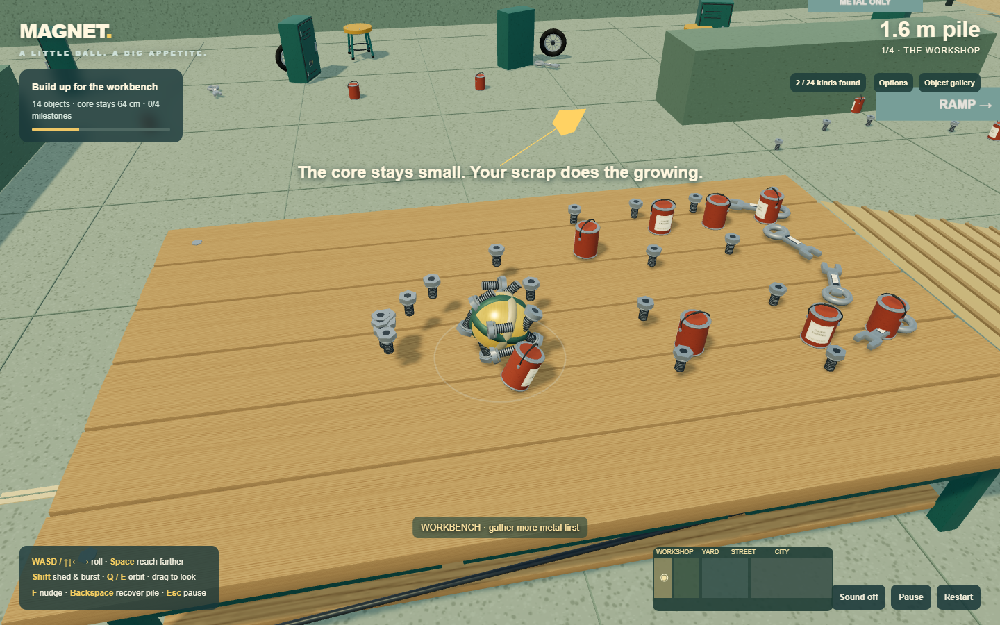

# MAGNET — Small core. Huge mess.

**[Play Magnet](https://dumb-tony.github.io/magnet/)**

Build a lopsided rolling pile around a magnet that stays 64 cm across. The attached metal creates the larger shape—no growing center ball.

Explore fifteen connected districts from the workshop through cities, shipyards and an orbital construction complex to the World Engine. Fifteen milestones escalate from a workbench to freighters, rockets, megacity spires, supercarriers, orbital rings and impossible planetary machinery. Keep exploring afterward. 2,157 objects, 74 types, 62 crushed variants and fifteen optional Field notes objectives.

[Inspect all 74 detailed objects](https://dumb-tony.github.io/magnet/showroom.html) · [Titan Foundry notes](docs/TITAN_FOUNDRY.md)

The overhauled renderer adds 512-pixel procedural PBR surfaces, 4K soft shadows, multi-scale contact shading, depth-reconstructed normals, screen-space reflection rays, highlight bloom, distance haze, filmic grading, distinct roads, masonry, wood, metal, glass, vehicle paint, landscaping and wind-swept grass. High and Low graphics settings are available. Large piles also gain cruising speed while retaining slightly heavier response. See the [environmental aesthetics pass](docs/AESTHETICS.md), [movement tuning](docs/MOVEMENT.md) and [graphics and airfield notes](docs/GRAPHICS_AND_AIRFIELD.md).

## Controls

- WASD / arrows: roll relative to the camera.
- Space: attraction (hold or toggle in Options).
- Click the game to capture the mouse; move it to look freely around the pile. Escape releases it. Q / E remain camera-orbit keys.
- F: nudge without shedding. Shift: shed recent pieces and burst.
- Backspace: recover the intact pile in an open area.
- Escape releases the captured mouse; press it again to pause and save. R restarts and Enter starts or resumes.

Click Field notes for optional discovery goals, or the collection count for the checklist. Click an unlocked district on the map (or Options → Travel) to return with your entire pile. The map shows your pile and next milestone. Options include reduced motion, low graphics, automatic unsticking and save controls. Runs autosave locally; Continue saved pile appears after reloading.

## Offline and earlier prototypes

Open `prototypes/m1/index.html` with its adjacent JavaScript files and `vendor` folder. No installation, build step or external requests. WebGL and desktop keyboard required. Three.js is locally bundled with its MIT license.

[First 3D experiment](https://dumb-tony.github.io/magnet/growth-first.html) · [Original 2D delivery experiment](https://dumb-tony.github.io/magnet/delivery-2d.html)

See [docs/DISTRICTS.md](docs/DISTRICTS.md) for current design/limitations and [docs/PLAYTEST_LOG.md](docs/PLAYTEST_LOG.md) for evidence. Historical design notes remain preserved. Private source excerpts and raw diagnostics remain local and ignored.

## Tests

- `node tests/graphics-browser.cjs`: previous-save migration, original 790 IDs, High/Low rendering, resizing, shader errors and late-route model previews.
- `node tests/movement-scaling-browser.cjs`: starting response, size-scaled cruising speed, camera pullback and late-game visible pace.
- `node tests/foundry-browser.cjs`: original 1,116 IDs, save migration, ninth-district progression, new crushed forms and map geometry.
- `node tests/detail-browser.cjs`: all 74 model bounds and geometry reuse, mesh batching, gallery controls, crushed previews and narrow viewport.
- `node tests/adventure-browser.cjs`: complete fifteen-district route, immutable attachments, continued late-game play and frame sample. `DIGITAL=1` quantizes the replay to keyboard-style directions; `GAME_URL` targets deployment.
- `node tests/pile-density-browser.cjs`: deep seating for every sampled pickup, dense-pile silhouette and hidden-interior rendering cap.
- `node tests/adventure-regression.cjs`: fixed core, shape contacts, rocking supports, saves, recovery, repulsion, 600 simulated stress seconds, repeatability, options and input checks.
- `node tests/adventure-storage.cjs`: reload/continue with exact attachment poses, clear save, offline request check and storage-denied play.

Browser tests need an installed Playwright (`PLAYWRIGHT_MODULE`) and Chrome (`CHROME_PATH`). Test dependencies are not required by players. Older tests target the archived prototypes.

GitHub Pages publishes only `prototypes/m1` from this project's own repository. Human feel and comprehension remain open gates; automation is not a claim that those passed.

Visual update: [distinct surfaces and permanent crushed models](docs/CRUSHING.md).

Expansion notes: [Railworks, dry docks, Field notes and saved-run compatibility](docs/RAIL_AND_DOCKS.md).
