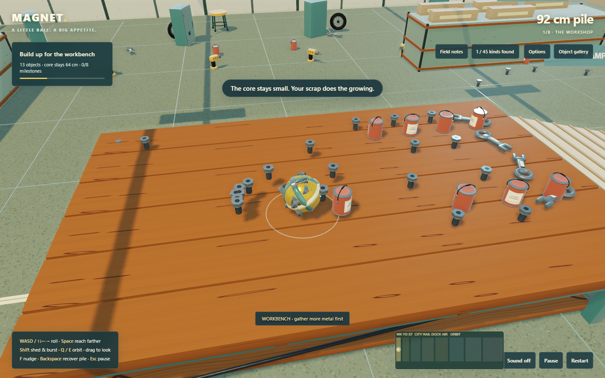
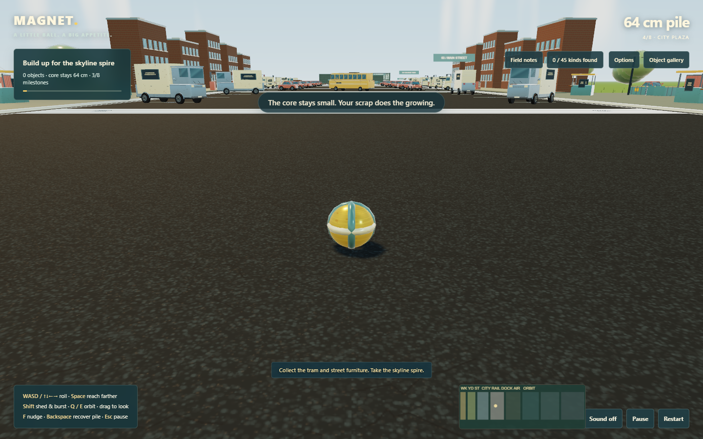
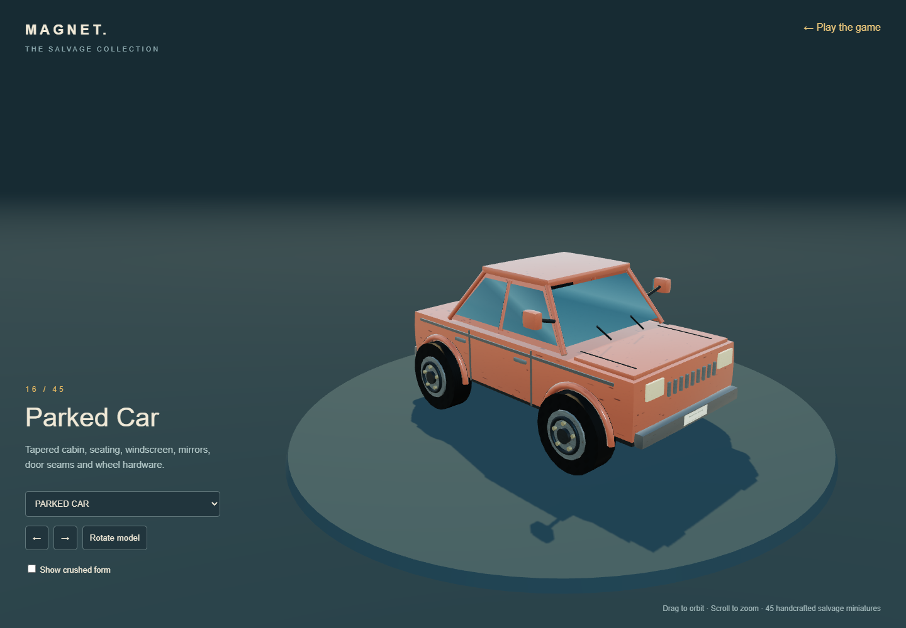

# Environmental aesthetics pass

[Play Magnet](https://dumb-tony.github.io/magnet/) · [Inspect the objects](https://dumb-tony.github.io/magnet/showroom.html)

The world now uses separate procedural surface constructions instead of one noise texture tinted many colors. Each material has its own color map, relief map, roughness response and repeat scale. Everything remains generated locally at startup, with no network dependency.

- Vehicle and machinery paint uses a clear-coated physical material with subtle orange-peel relief, worn chips and reflected environment light.
- Steel has directional brushing, fine scratches and sparse oxidation. Explicit rusted steel uses pitting, layered brown tones and much higher roughness.
- Brick has staggered mortar, irregular joints, chipped faces and stronger bump relief. Concrete has aggregate and hairline cracks; asphalt has dense stone and tar fissures.
- Timber has layered grain and knots. Rubber has recessed tread. Glass has low roughness and broad diagonal reflections. Water retains animated ripples.

The background now surrounds the route with two layers of hills, distant city silhouettes, tree lines and 2,800 individually positioned grass blades rendered in one instanced draw. The blades bend in a low, asynchronous wind animation, which freezes with Reduced motion. A cooler fill light separates shadowed forms while warmer sunlight, softer shadow filtering, the existing reflected environment and depth-aware contact shading define the main shapes. The extended horizon now reaches beyond the Titan Foundry.

Ordinary pickups no longer create text notices. The brief core flash and optional sound still acknowledge collection. Milestone, recovery and save messages remain because they report uncommon state changes. The large world-space objective arrow has been removed; players can use the environment, small milestone panel and map without a pointer hovering over the pile.

The geometry remains stylized and procedural. Brick edge wear is represented through bump relief rather than individually displaced bricks, and grass blades do not have collision. High graphics uses the depth-aware finishing pass and full shadows; Low graphics remains the fallback for slower hardware.
