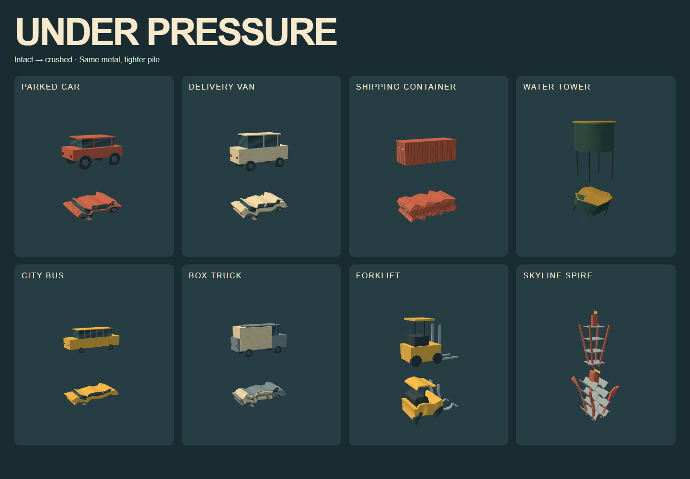

# Under pressure: visual and crushed-object pass

The magnet stays 64 cm across. New attachments pack at 72% of combined proxy radii (previously 89%), deliberately allowing overlap to close the visible air gaps. Existing attachments keep their root positions and rotations. Magnetic strength still comes from collected mass; crushing does not destroy mass or slow input.

## Surfaces

Eight deterministic offline Canvas textures: directional brushed steel, chipped painted metal, timber grain, rubber tread, reflective glass gradients, masonry courses, granular concrete and asphalt aggregate. Roughness and bump depth differ by material. Large surfaces repeat their textures instead of stretching a single image across a district. Vehicle roofs, window pillars, wheel hubs, bumpers and rear lights improve silhouettes; containers have corrugated ribs and locking bars.

## Crushed designs implemented

- Cars and vans: low collapsed cabins, skewed roofs, folded body panels and compressed wheels.
- Buses, trucks and trams: concertina body folds and flattened roof/cargo volumes.
- Shipping containers: accordion sidewalls and roof, with bent locking bars still visible.
- Water towers: flattened dented tank, displaced upper section and buckled supports.
- Forklifts: bent mast/forks and folded canopy.
- Lockers, drums, skips and kiosks: shortened, creased shells.
- Skyline spire: compressed lattice and tilted platforms.

These are vertex-deformed model variants, not a larger center sphere or a scaled intact root. Shared geometry keeps the variants reusable. A 300 ms morph shows the crush on collection; reduced-motion mode applies the final shape immediately. Collision proxies use the final crushed bounds. The effect is authored arcade deformation, not a force-based soft-body simulation.

Crushed state survives shedding, recovery and saving. Old district saves remain readable: pieces already attached in an old save retain their original shape and pose, while newly collected eligible objects crush. A fresh run shows the denser packing throughout.

## Validation

`tests/crush-browser.cjs` checks all 13 crushed kinds have smaller bounds and lower height, exact attachment restoration, permanent deformation on five shed objects through save/restore, fixed core and eight material patterns. It renders the comparison sheet. Full normal and digital-input routes, the 600-second physics stress regression and offline/storage tests also pass. These are automated input replays and visual screenshot inspection, not human feel testing.
