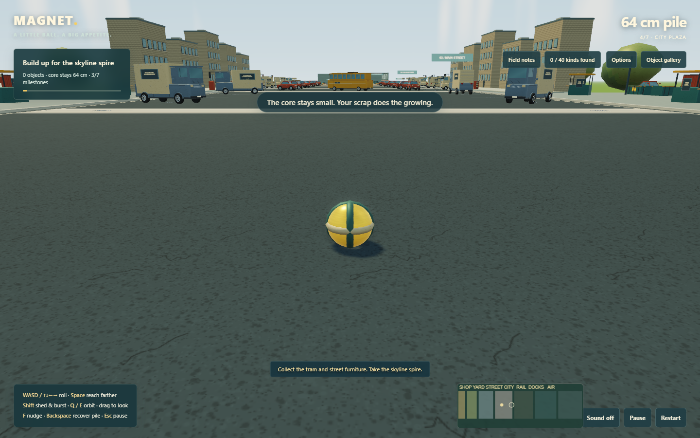
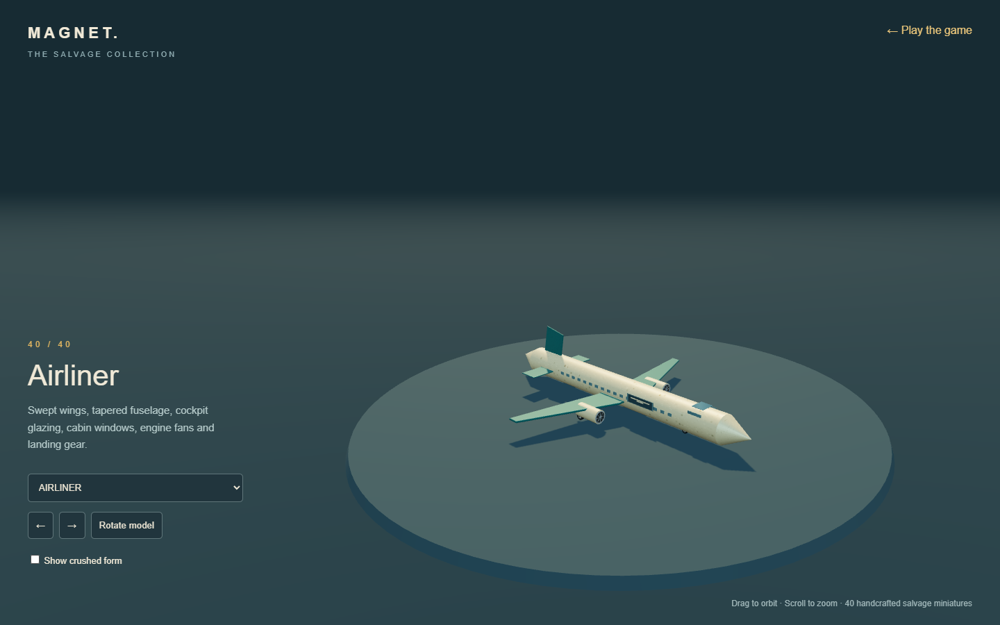

# Graphics and Meridian Airfield

[Play Magnet](https://dumb-tony.github.io/magnet/) · [Inspect the models](https://dumb-tony.github.io/magnet/showroom.html)

The active game now has seven districts, 967 collectible objects, 40 object types, 28 crushed variants and eight optional Field notes objectives. The original 790 IDs and save version are preserved. A completed dry-docks save opens the airfield on restoration; existing attachments keep their poses.

## World graphics

The workshop has structural beams, hanging fixtures, storage framing and wall panels. The yard gains timber boards and loading markings. Asphalt, curbs, crosswalks and drains define the streets; framed glazing, sills, roof trim and utility equipment give the city buildings more depth. Trees, grass and distant hills surround the route. Rail ballast, warehouse cladding, quay fenders and runway markings finish the later districts.

Warm sunlight and shared reflected lighting work with the existing distinct material maps. High graphics adds an HDR render target, antialiasing, a subtle depth-based contact-shading pass and a restrained vignette. Low graphics bypasses that pass and directional shadows. Unsupported floating-point render targets also fall back to direct rendering. The atmosphere uses a procedural sky and slowly moving clouds; reduced motion freezes that animation.

Scenery is combined into material batches. Decorative additions do not introduce new collision obstacles across the existing route. Contact shading is an eight-sample screen-space approximation, not ray tracing; it cannot shade hidden geometry. Geometry remains stylized and procedural. This update requires no external art services or network requests during play.

## Seventh chapter

Meridian Airfield extends the course from x=1020 to x=1530. The cargo freighter opens the gate. A runway, apron, hangars and a small-object rebuilding corner support continued exploration. New salvage includes ribbed rolling suitcases, loaded baggage carts, fuel trucks with banded tanks, propeller planes, glazed control towers and a final airliner.

Aircraft include wings, tail surfaces, cockpit and cabin glazing, landing gear and engine or propeller detail. The airliner has swept wings and engine fan blades. All six new types have permanent crushed forms, previewable in the gallery and retained through shedding and save restoration. Crushing remains an authored deformation, not a rigid-body fracture simulation.

## Validation

Complete movement replays cover all seven milestones with normal and keyboard-style digital directions. Graphics checks cover old-save migration, original layout IDs, shader errors, nonblank rendering, viewport resizing, High/Low switching and intact/crushed gallery previews. The existing long-run physics, storage, model and crushing regressions also pass. These are automated browser tests and rendered visual review, not human feel testing or a hardware compatibility benchmark.
