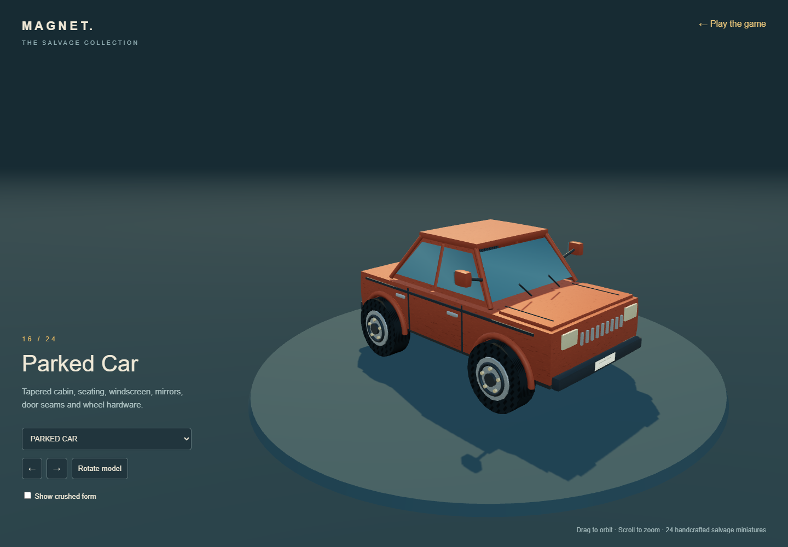
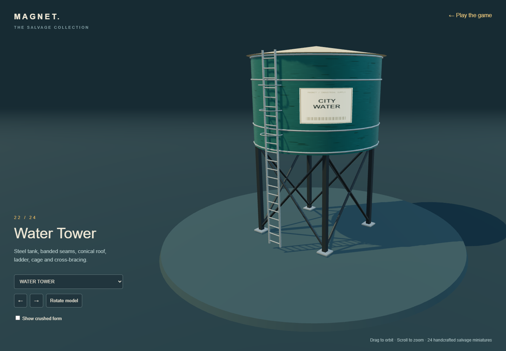
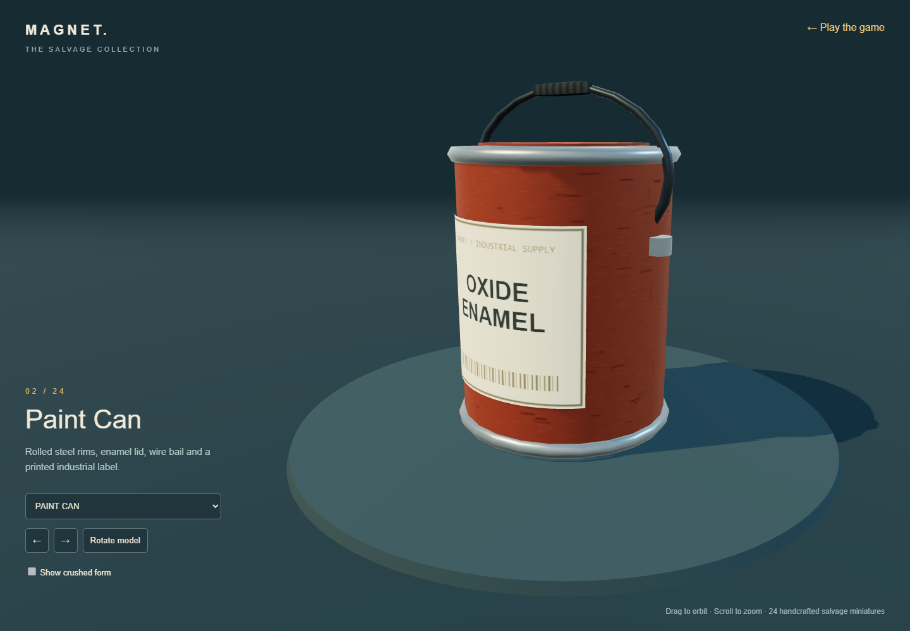

# Salvage collection: detailed object pass

All 24 collectible types now use authored 3D miniatures from `detail-models.js`. This replaces the original primitive model function. The models, labels, surface maps and reflection lighting are generated locally; no Higgsfield or third-party generated assets were used. The art direction remains stylized industrial miniatures rather than photorealism.

## Construction

- Workshop: threaded hex bolts, rolled paint-can rims and curved labels, forged wrench jaws, pipe flanges and fasteners, laced wheels, braced stools, hinged lockers and a plank workbench with drawers and steel bracing.
- Yard: ribbed drums with bungs, tubular carts with casters, triangulated bicycle frames with pedals, open scrap skips and forklifts with controls, seats, hydraulics and canopies.
- Street: hydrant caps and chains, punched sign poles, tapered car cabins, mirrors, wipers, grilles, door seams, treaded tires and wheel hardware. Vans have enclosed cargo bodies and roof racks; buses have separate window bays and destination boards.
- City: freight trucks with shutter doors and fleet markings, kiosks with newspaper stacks, corrugated containers with locking gear, water towers with ladders and bracing, tram roof equipment and a lattice skyline spire.

Materials distinguish rubber, painted shells, brushed steel, glass, wood and printed labels. Softer wear patterns and a shared reflection environment give metal edges and curved parts readable highlights. A single 2048-pixel atlas holds the printed labels. Cylinder labels wrap around the surface instead of floating as flat cards.

## Crushed forms and performance

The 13 existing crush profiles now deform the detailed source models, so hardware and labels remain attached. Long box panels receive extra subdivisions to form folds. Final collision proxies still use crushed bounds; the magnet core and attachment root scale stay fixed. New model bounds can change a particular run's collection order, but the course, objectives and movement code remain unchanged.

The renderer combines parts that use the same material and reuses cached geometry between copies. Examples: a container has 75 authored components rendered in four batches; a forklift has 57 components in eight batches; a threaded bolt has 13 components in two batches. Crushing uses the same batching path and retains its short morph animation. Batching avoids rendering every rivet or thread ring separately.

## Interactive review

Open the game's **Object gallery** button, or visit `showroom.html`. Choose any of the 24 models, drag to orbit, scroll to zoom, pause rotation and compare its crushed form where supported. Opening the gallery during play pauses and saves the run. The gallery works offline with the adjacent game scripts and supports a narrower layout.

## Verification

Automated checks cover all 24 finite model bounds, shared geometry, material batching, gallery selection/orbit/crush controls, unsupported crush states, and a narrow viewport. The existing complete normal/digital movement routes, 600-second stress run, fixed core, attachment persistence, save/reload, shedding, storage-denied and offline checks were also run. Model and gameplay screenshots were visually inspected. These are automated input replays and rendered visual reviews; no human feel-test result is claimed.
