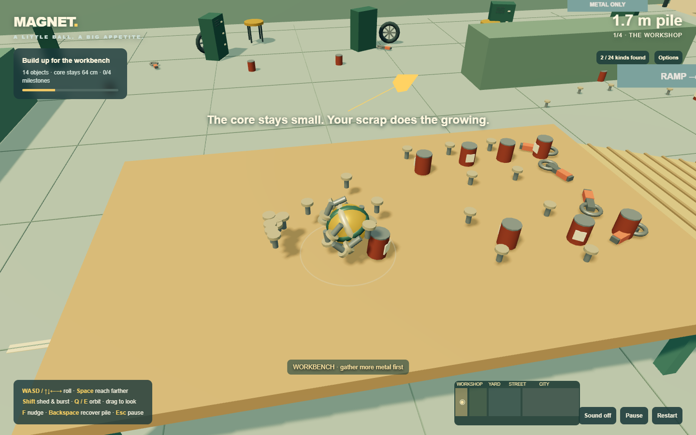
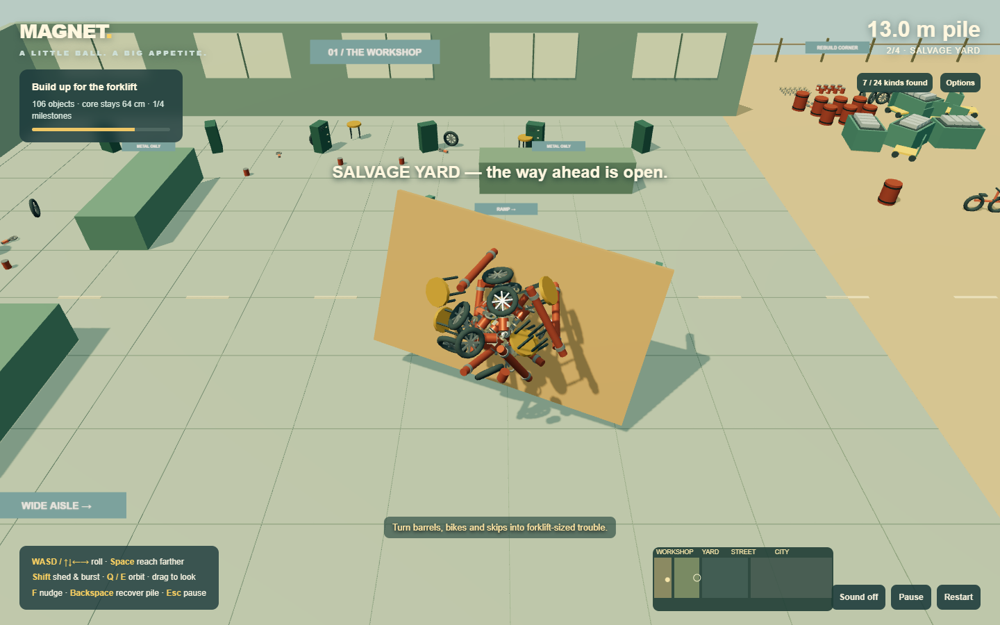
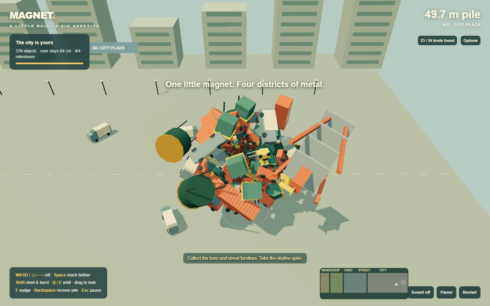
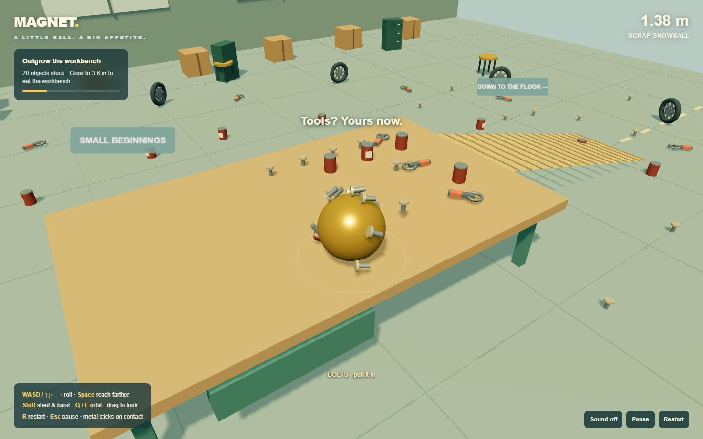
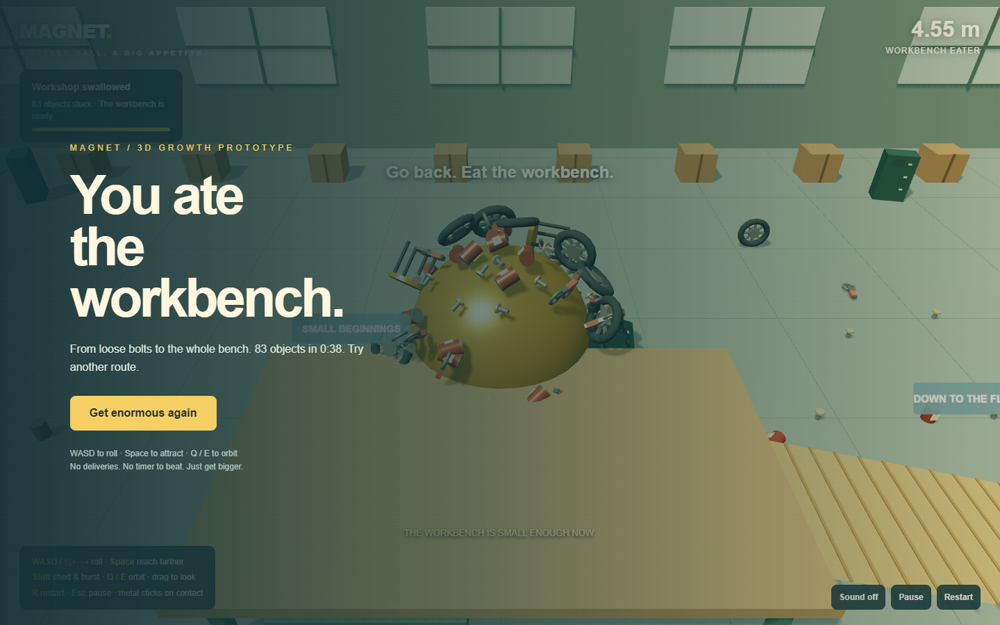
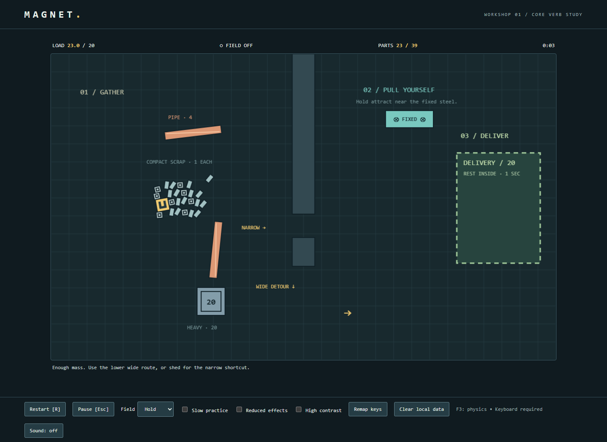
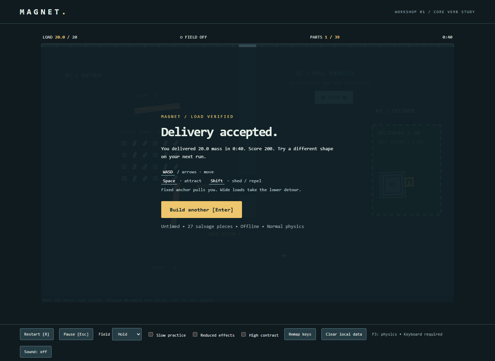
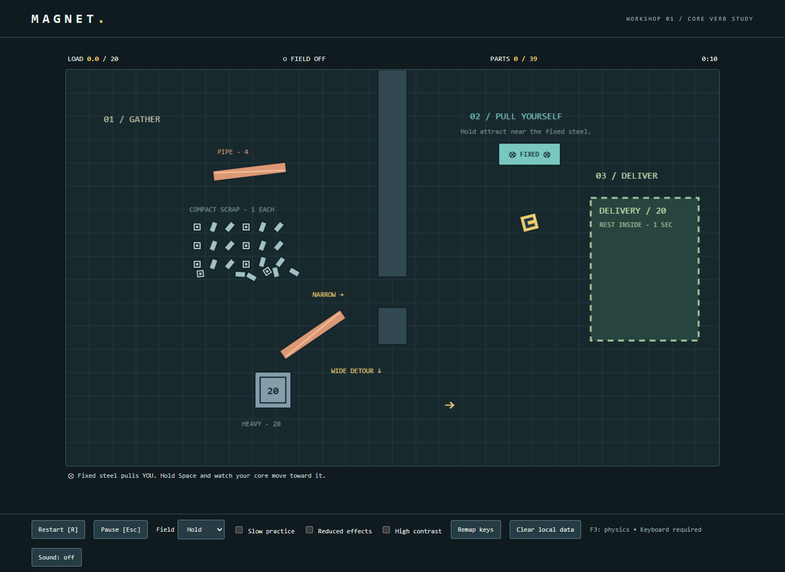

# Magnet — Playtest log

M1 has automated simulation/browser evidence and user feedback below. No recruited fresh-player sessions have been performed. Subjective acceptance thresholds remain open.

## Fixed core and four districts — magnet-districts-1

User direction: preserve a physical lopsided pile but prevent navigation dead ends; deepen the workshop, then add yard/street/city; use milestones without time pressure and revisit that choice after play. **Decision: extended build ready for user feedback; human-feel gate remains open.**

Implemented the fixed 0.32-radius core, persistent unit-scale attachments, shape-based ground support and obstacle contacts, 490 objects / 24 kinds, four districts and milestones, an optional tram, post-ending exploration, rebuild corners, map, collection checklist, visible gates, nudge/unsticking/recovery, save/continue and comfort options. Detailed limits and the proxy collision model are in DISTRICTS.md. Previous prototypes remain available.

### Verified behavior

- Full scripted movement route through workbench, forklift, bus and skyline spire passed at 85.892 simulation seconds with 363 attached objects. No direct pickup calls, teleportation or fixture placement were used in that route. A separate replay with movement quantized to keyboard-style directions also passed: 175.292 seconds, 221 attachments. Different paths/assemblies make these timings unsuitable as a controlled speed comparison or human completion target.
- The core scale stayed exactly 0.32 throughout. Every attached model retained scale `(1,1,1)`. Old attachment positions and quaternions remained unchanged when later objects joined. A bug that overwrote a newly attached mesh with its old world position was caught by this test and fixed before publication.
- Controlled collision fixture: bare core produced zero shelf contacts; adding a long pipe produced two contacts at the same core location. Rotating that assembly changed required support height from 0.32 to 1.373 units. This confirms shape affects clearance and rolling, not merely appearance. The fixture is separate from the normal route.
- Repulsion released recent IDs, preserved the total object count, and blocked their immediate return. Recovery retained all attached IDs. Exact attachment poses survived save, browser reload and Continue. Clear save remained cleared after reload; testing caught and fixed an autosave-on-reload recreation bug. Denied storage remained playable. Offline test made zero HTTP requests.
- 600 simulated seconds / 72,000 steps of cyclic movement, attraction, shedding and recovery: 490 total objects retained, finite state, consistent collected counts and immutable attachments across 600 sampled audits; peak 309 attachments. Mean sampled step 0.0403 ms, max 5.5 ms. This was accelerated simulation, not ten minutes of human play.
- After completing the normal route, 60 further simulated seconds of movement remained stable with 378 attached objects and an approximately 49.7-unit pile span. Core remained fixed; three gentle automatic nudges occurred and no manual recovery was used. Maximum measured late-game step was 1.2 ms.
- 30/60/120 scheduling traces matched pickup count and position within 1e-7 world units. Twenty consecutive reset counts matched. Pause/resume, focus-loss pause, nudge/recovery keys, toggle attraction, reduced motion, low graphics and collection panel passed browser checks with zero page errors.
- Chrome 153.0.8010.37, headless, 1440×900 on the previously recorded Ryzen 9 9950X / Radeon-equipped PC. Late-game frame sample: mean 4.999 ms, max 5.3 ms, 1,731 draw calls. These short headless timings are not a broad hardware or human smoothness guarantee.

### Review and next gate

Publication: implementation commit `3f35d7e` deployed successfully in GitHub Pages run `34776291290`. The complete keyboard-style four-district browser route and post-ending continuation then passed against `https://dumb-tony.github.io/magnet/?v=districts-1` with zero page errors. The final documentation/whitespace cleanup does not change behavior.

Agent inspected early fixed-core, workshop pile, street and city screenshots. The final landmark is an angular steel spire so it cannot be mistaken for another growing golden core. Removed roof obstructions, stabilized reduced-motion vertical framing, and made recovery caches off-route rather than mandatory.

Remaining human questions: whether rocking is amusing or tiring; whether assisted contacts are forgiving enough; whether milestone pacing feels natural; and whether the larger world stays interesting after the first run. The solver uses coarse compound spheres and assisted motion, not independently articulated objects. Camera clearance is approximate, and desktop keyboard/WebGL are still required. No fresh-tester enjoyment or comprehension results are claimed.

## 3D growth pivot — growth-3d-1

User authorized replacing junk delivery with rolling magnetic growth in a 3D world. The old delivery test gates are historical; this new core-loop experiment needs new human feedback. Decision: **iterate on growth feel**, not proceed to a full-world game.

Built one perspective WebGL workshop, a tabletop/ramp/floor route, 103 collectible objects, size-gated pickups, camera-relative rolling, orbit controls, visible rotating attachments, magnetic reach, shedding/burst and a workbench-absorption ending. Old 2D gameplay is preserved in delivery-2d.html. See PIVOT_3D.md for intentional arcade collision approximations and runtime licensing.

Automated tests used installed Chrome 153.0.8010.37, headless, 1440×900 on the previously recorded Ryzen 9 9950X / Radeon-equipped PC. No human feel session or fresh-player pass is claimed.

- Offline file:// keyboard start, movement and pickup passed. Escape/Enter pause/resume, synthetic focus loss and result restart passed with zero page errors.
- Complete normal-layout scripted movement route, without teleports or direct pickup calls: tabletop 34 collected, ramp descent to floor 41, growth to bench eligibility 77, ending 81 objects and 4.43 m diameter at 23.717 simulated seconds. This optimized route is not an expected first-player completion time.
- Complete route with deliberate post-tabletop shedding also passed: five objects released, eventual bench ending with 83 objects at 38.858 simulated seconds. Separate burst check reduced attachments, kept all 103 object identities and prevented immediate reattachment of ejected pieces.
- A 300-second / 36,000-step accelerated stress run with cyclic movement, attraction and repeated bursts retained all objects, finite positions and consistent collected/attached counts. Peak attached count 27 and radius 1.007. Mean measured step 0.00215 ms, max 0.4 ms (submillisecond timer resolution limits interpretation). This does not substitute for long human play at maximum growth.
- Fifteen-second input traces scheduled at 30/60/120 FPS produced matching positions and pickup counts within 0.001 world units. Fifty successive resets passed. Denied localStorage remained playable. Keyboard camera orbit produced finite camera positions.
- Short active-render sample: 120 frame intervals averaged 5.0 ms, max 5.2 ms; 265 draw calls in the sampled scene. This is local headless evidence, not a broad hardware performance guarantee.
- Agent visually inspected start, rolling assembly, orbit and ending screenshots. Tuned small-part attachment offsets to prevent the growing shell hiding collected bolts, reduced floating sign size, and removed rafters that obstructed the following camera.

Next human check: does growth feel satisfying, are larger pickups readable, is camera control comfortable, and does the player want a longer run? No enjoyment or comprehension gate has been marked passed.

## Speed tuning — m1-2

User feedback: "it just goes way too slow." Increased base thrust from 1450 to 3000 with sublinear mass compensation `(mass / 5)^0.35`. Under sustained unobstructed input, the force/drag model now gives approximately 248 px/s empty (previously 120) and 87 px/s with a 20-unit load (previously 24). These are calculated steady-speed values, not human measurements. The 900 acceleration and 360 speed limits permit the new pace. Release braking rises from 2.4 to 6/s when neither movement nor field is active; attraction and repulsion retain their existing force settings. Records use the new m1-2 namespace so faster results are not compared against m1-1.

Automated Chrome full-route retest: heavy block delivered in 19.383 simulation seconds; compact-start mixed assembly delivered in 34.458 seconds. The faster compact-start replay also picked up a pipe (28 salvage mass carried), so its timing is not a controlled same-assembly comparison. The heavy route now settles briefly before engaging attraction; this accommodates the higher arrival velocity and verifies braking. Narrow traversal to anchor, keyboard collection, pause/focus/restart all passed with zero JavaScript errors. Seven physics regressions passed, including pipe jam/shedding recovery, momentum/pose retention and identical 30/60/120 scheduling traces. The 600-second / 72,000-step Chrome stress retest retained all 40 parts with no escaped or non-finite bodies (mean 0.710 ms/step, p95 1.0 ms, max 3.6 ms; sampled wall penetration below 0.079 px). The separate 40-part compound contact/release fixture and storage-denied controls checks also passed. No human-feel pass is inferred; next feedback should judge pace and stopping distance.

## 2026-09-13 — workshop 01 / rules and physics m1-1

**Decision: iterate within M1.** Mechanic implementation and automated routes are ready for human testing; do not proceed to M2 on this evidence.

Test machine: AMD Ryzen 9 9950X (16 cores); Windows reports Radeon RX 9070 XT and integrated AMD Radeon Graphics. Browser: installed Chrome 153.0.8010.37, automated headless mode, 1440×1050 viewport, 1120×680 canvas backing resolution. Physical display resolution and headless GPU adapter selection were not established. Timing below is a local automation benchmark, not a claim about human-perceived smoothness on all hardware.

### Tests and observations

- Seven targeted Node/VM tests passed on the embedded source: offline/storage-denied reset and 100 resets; merge pose plus linear/angular momentum conservation; heavier-body reaction and static anchor pull; repel retention/cooldown; pipe obstruction and recovery; one-second delivery/no duplicate score/result reset; 30/60/120 rendered-frame scheduling traces.
- Traces at all three scheduling rates simulated 10.000 s and ended at `(138.994948, 660.408631)`, score 0. Difference 0%, below the 2% threshold. This is a deterministic movement/boundary input replay with identical fixed steps, not an actual monitor refresh-rate test or cross-browser guarantee.
- Chrome keyboard interaction started the game, moved and attracted compact scrap, and checked pause, resume, synthetic focus loss and restart. Zero JavaScript page errors. Screenshots were visually inspected by the agent.
- Complete normal-layout movement/field replays (no body placement): heavy block through the lower detour to delivery in 40.783 simulation seconds, 20 units / 200 points; compact collection through the lower detour in 49.717 seconds, 21 settled units / 210 points from a 23-unit carried load. Unloaded core passed the narrow route and reached the fixed-anchor field. These are automated route completion, not manual feel testing.
- A focused pipe fixture attempted the 52 px opening, stayed blocked, then shed and backed away. A separate controlled 40-part compound fixture made wall contacts for 20 simulation seconds, retained every collider, then released all 39 salvage pieces and recovered with reverse movement. Debug fixture geometry is not a claim that a fresh player assembled that shape.
- **600 simulated seconds / 72,000 steps at 40 physical parts in Chrome**, alternating field each second with cyclic movement: 40 retained, no non-finite or escaped bodies; peak attached count 22; 12 sheds; peak 108 solver contact events per step (includes solver iterations). Maximum sampled wall penetration 0.062 px. Mean step 0.744 ms, p95 1.000 ms, maximum 3.900 ms. This is an accelerated simulation stress session, not ten wall-clock minutes of human play. An earlier VM stress run was stopped in favor of this completed in-browser measurement because VM overhead made it slow; no pass is claimed for the cancelled run.
- During active play, 179 sampled Chrome frame intervals averaged 5.715 ms and peaked at 6.600 ms. This short headless sample exceeds the 60 FPS budget, but a prolonged visible-browser/human smoothness check remains a gate.
- Browser controls checks passed with localStorage deliberately denied: both-held field off, toggle on/off, slow practice, reduced effects, contrast, six-key remap and reset-to-default controls. The game remained playable and produced no page errors. Settings/records use guarded storage; no online service is required.

### Tuning and limitations

The first route check established that 1450 constant thrust makes the heavy block take a noticeably longer scripted route than an empty core; the final implementation adds an independent 360 units/s² aggregate acceleration cap so many nearby objects cannot multiply acceleration without bound. Full routes were rerun after that change. Attachment cooldown is 0.65 s, capture threshold 90 px/s, and four contact iterations retain visible pipe clearance. See IMPLEMENTATION_M1.md for exact constants.

Attraction can gather nearly the whole compact pile in one pass. Human testers must determine whether this is too automatic and whether global shedding feels recoverable rather than frustrating. The anchor is optional, so automated anchor force checks do not prove every tester notices it. The square core and rigid rectangular compounds are intentional M1 approximations. Sound is optional generated pickup/shedding ticks; no collision audio layering. Mobile/touch play is not implemented. Tests cover Chrome, not a browser compatibility matrix.

**Fresh-player gate: 0/5 tested.** Still required: four deliver and explain handling, three deliberately shed or choose shape, three voluntarily retry, all observe normal anchor pull. No comprehension, voluntary retry, fun or human-feel pass is claimed. Next experiment: the original five-person, ten-minute workshop session; tune only core handling/readability afterward.

### Reviewed assembly evidence

### Publication verification

Public play URL: https://dumb-tony.github.io/magnet/. GitHub Pages workflow run `34739473385` successfully deployed implementation commit `0b5844f`. The same Chrome browser regression was then run against the public HTTPS URL: start/keyboard collection, pause/focus/restart, heavy and compact complete deliveries, and narrow traversal to anchor all passed with zero JavaScript errors. The initial sandbox network-denied attempt was retried with authorized network access; it was not a deployment failure. This publication note changes no playable code.

### Screenshots

## Entry template

- Date / build / course / physics version:
- Test PC CPU, GPU, browser, resolution:
- Tester familiarity and accessibility settings:
- Hypothesis being tested:
- Task, attempt count and observed results:
- Completion time / relevant score / mechanic-specific metrics:
- Voluntary retry and comprehension observations:
- Bugs, unfair states and performance measurements:
- Parameter changes and why:
- Retest evidence:
- Decision: proceed / iterate / park:
- Unresolved questions and next bounded experiment:

## 13 September 2026 — Detailed salvage collection

Rebuilt all 24 collectible types, retained 13 crushed variants, added shared reflection lighting and an interactive object gallery. Authored components are batched by material: 75 container components become four draw batches; 57 forklift components become eight. The core remains 0.32 m in radius.

Validation: complete normal and digital input replays reached all four milestones. The final digital replay continued with 288 attached objects, measuring 12.83 ms average and 15.2 ms maximum frame intervals over 120 samples (Chrome 153, 1440 × 900, local headless run). Results vary with pile and camera position; this is not a broad hardware benchmark. The 600-second regression, attachment invariants, save/reload, shedding, storage-denied and offline checks passed. The new gallery test checks all 24 model bounds/caching, rotation, selection, supported/unsupported crushed previews and a 600 × 850 viewport. Zero JavaScript errors were reported.

Reviewed close-up screenshots of cars, vans, tower, bench, bolt, bicycle, container, forklift and paint can, plus the four-district gameplay screenshots. This is automated play and rendered visual inspection, not fresh human feel testing. Asset notes and screenshots: docs/OBJECT_ART.md.
