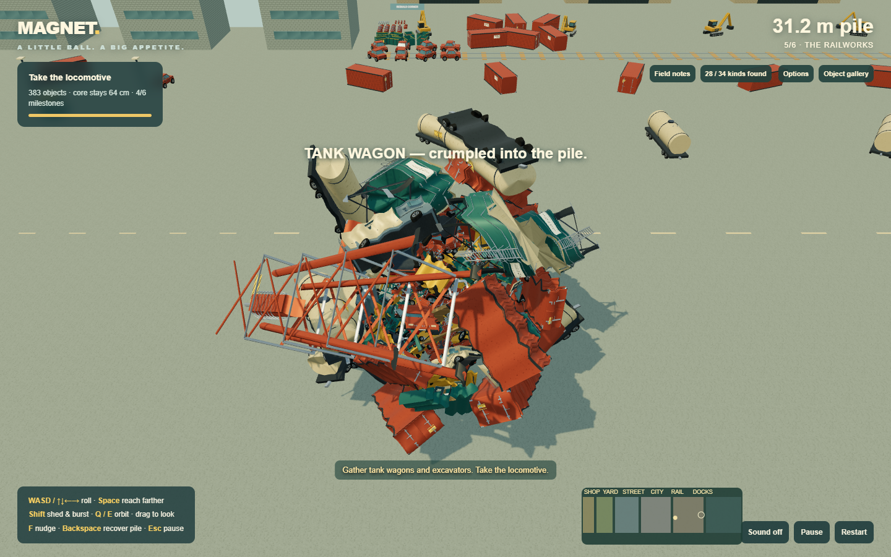
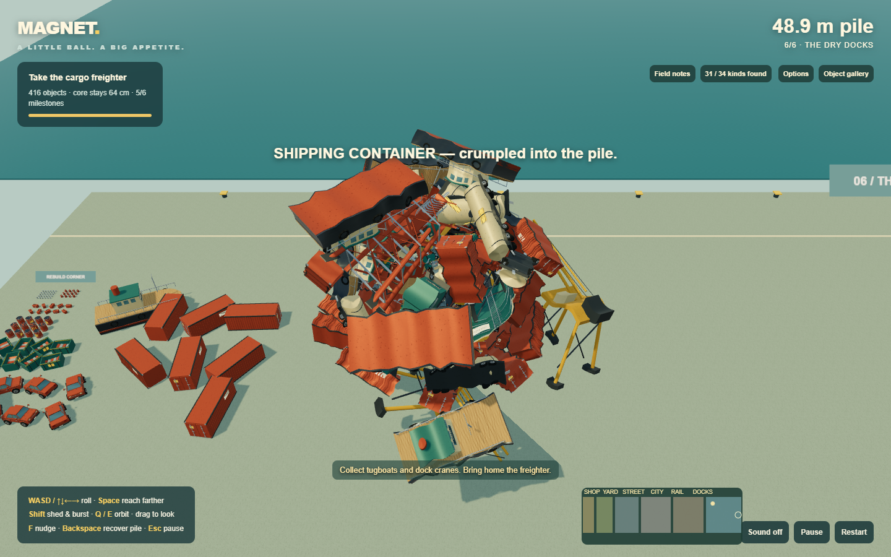
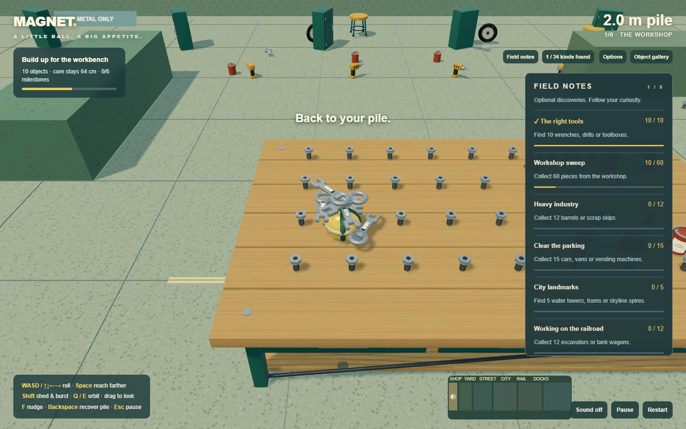

# Railworks and dry docks expansion

The active game now has **six connected districts, 790 collectibles, 34 object types, 22 crushed variants and eight optional discovery goals**. The original four districts lead into two larger areas. The magnet remains 64 cm across.

## New route

Collecting the skyline spire opens the railworks. Its freight lanes, warehouses, excavators and tank wagons build toward the locomotive. The locomotive opens the dry docks, where tugboats and gantry cranes provide the mass needed to collect a 42 m cargo freighter. The final milestone still allows continued exploration.

The main route remains level and open, with scenery, rails and quay markings establishing each area's character. Boats are salvage in a dry dock, not a sailing minigame. Broad bounds, assisted rolling and recovery continue to favor navigation with a lopsided pile.

## New objects

Toolboxes and drills add discoveries to the workshop. Vending machines and traffic lights add street furniture. Excavators, tank wagons, locomotives, tugboats, dock cranes and a cargo freighter extend the size progression. The gallery includes all ten new types with authored hardware and surface detail. Nine of the ten new objects have permanent crushed variants; the small drill retains its rigid shape.

## Field notes and travel

Eight optional goals encourage tool collecting, workshop exploration, clearing parked vehicles, finding city landmarks and exploring industrial salvage. Progress counts unique object IDs: shedding and recollecting the same piece does not earn duplicate credit. Notes persist with the saved run. They do not gate district exits or impose a timer.

Click an unlocked district on the minimap, or choose it under **Options → Travel**, to return with the entire pile. Later districts remain locked until their preceding milestone is complete. This supports returning for missed discoveries without repeating the full journey.

## Compatibility

The first 490 object IDs retain their original type and layout order. New objects are appended. Existing saves remain readable; saves that already contain the skyline milestone automatically unlock the railworks. Old saves without field-note data initialize it from their attached objects, since historical shed-object discoveries were not recorded. Saves do not leave the browser.

## Validation

The full normal and digital-input routes cover all six milestones using movement and attraction. Focused regressions verify legacy IDs and completed-city migration, travel gates and attachment retention, shedding beyond the original city boundary, objective deduplication and restoration, and all ten new gallery models. The 600-second stress, offline/storage, detailed-model and crushed-model tests remain part of the release checks. These are automated replays plus screenshot inspection; no human feel-testing result is claimed.

