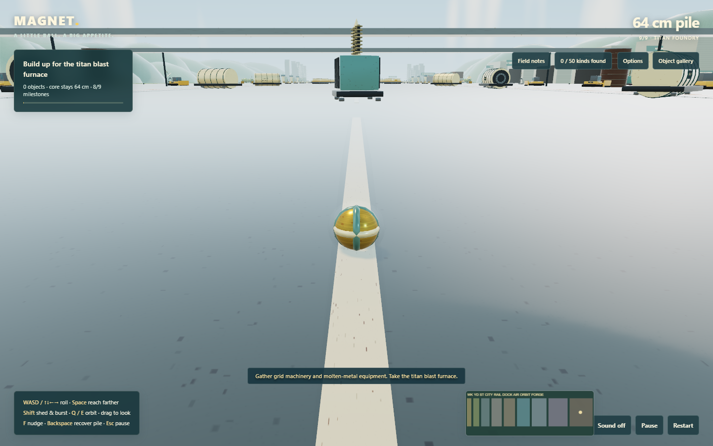
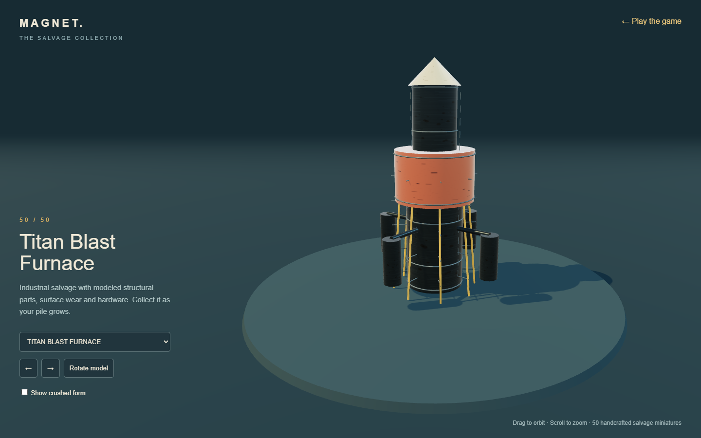

# Titan Foundry

The orbital rocket now opens a ninth district spanning x=2120–2820. It is wider than every previous area so the largest piles can navigate without losing their irregular silhouette. The route ends at a 60-metre Titan Blast Furnace.

Five new detailed collectible families raise the collection to 50 types:

- Power transformers with cooling fins, ceramic bushings, steel feet and grid hazard plates.
- Crawler dozers with individual track shoes, rollers, glazed cabs and broad articulated blades.
- Turbine generators with ribbed shells, intake fans, foundation skids and grid markings.
- Molten-metal ladles with tapered vessels, trunnions, lifting frames and rated-capacity plates.
- The blast furnace with stacked shells, bustle pipes, structural legs, service rungs and auxiliary vessels.

Every new family has a permanent crushed form. The deformation profiles buckle height to 38–50% of the source profile and reduce occupied volume while keeping mass, model scale and the 64 cm magnet core unchanged.

The environment adds furnace halls, ore vessels, elevated truss bridges, smokestacks, slag channels, hazard walkways and an expanded landscape. A ninth Field note rewards collecting foundry machinery. The minimap remains 260 pixels wide and redistributes its district bands rather than growing over the controls.

The expansion appends 181 objects, bringing the route to 1,297. All previous 1,116 object IDs remain unchanged. A saved run that already collected the rocket migrates directly into the Titan Foundry with its pile intact.

Automated checks cover the original-ID prefix, saved-run migration, all 50 model bounds and caches, all 38 crushed profiles, map width, reachable foundry power, ninth milestone, fixed core and the complete movement route. Buried-interior rendering now caps the visible shell at 360 objects while preserving every item's collision, mass and save data. Static scenery is combined by material, turning 6,520 authored components into 243 render batches. Rendered gallery, district and dense-pile screenshots were reviewed. These checks do not replace human feel testing.
